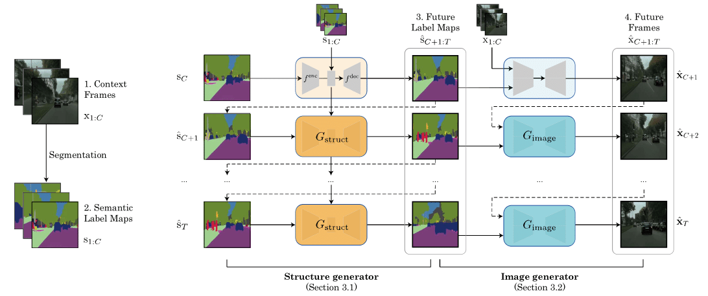

# Hierarchical Video Prediction

PyTorch implementation of our paper, [Revisiting Hierarchical Approach for Persistent Long-Term Video Prediction](https://openreview.net/forum?id=3RLN4EPMdYd&referrer=%5BAuthor%20Console%5D(%2Fgroup%3Fid%3DICLR.cc%2F2021%2FConference%2FAuthors%23your-submissions)), which will be presented in ICLR 2021. Please check out more qualitative results in our [project page](https://1konny.github.io/HierarchicalVideoPrediction/).

<p align="center">
    
</p>

## Architecture 
<p align="center">
    
</p>

## How to use

### Step 1: Clone and setup the repo.

```bash
REPO_DIR='/path/to/clone/this/repo'
git clone https://www.github.com/1Konny/hierarchicalvideoprediction $REPO_DIR

cd $REPO_DIR
bash scripts/dependency.sh

cd $REPO_DIR/image_generator
python scripts/download_models_flownet2.py
python scripts/download_flownet2.py

cd $REPO_DIR
```

### Step 2: Train structure generator.

```bash
CUDA_VISIBLE_DEVICES='0,1,2,3' bash scripts/train_structure_generator.sh $DATASET
```

, where `DATASET` can be one of `KITTI` or `Cityscapes`.

### Step 3: Extract semantic-level predictions using the trained structure generator.

```bash
CUDA_VISIBLE_DEVICES='0' bash scripts/test_structure_generator.sh $DATASET
```

### Step 4: Train image generator.

```bash
CUDA_VISIBLE_DEVICES='0,1,2,3' bash scripts/train_image_generator.sh $DATASET
```

### Step 5: Extract RGB-level predictions using the trained image generator and predictions from the structure generator.

```bash
CUDA_VISIBLE_DEVICES='0' bash scripts/test_image_generator.sh $DATASET
```


## Acknowledgement

- This repo is largely borrowed and modfied from [SVG](https://github.com/edenton/svg) and [Vid2Vid](https://github.com/NVIDIA/vid2vid).

  

## Citation

```
@inproceedings{
lee2021revisiting,
title={Revisiting Hierarchical Approach for Persistent Long-Term Video Prediction},
author={Wonkwang Lee and Whie Jung and Han Zhang and Ting Chen and Jing Yu Koh and Thomas Huang and Hyungsuk Yoon and Honglak Lee and Seunghoon Hong},
booktitle={International Conference on Learning Representations},
year={2021},
url={https://openreview.net/forum?id=3RLN4EPMdYd}
}
```
